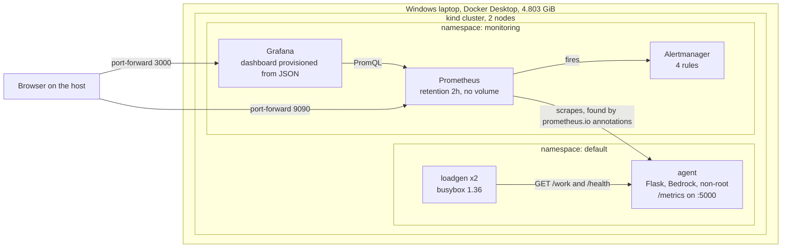

# Convergence artifact: an instrumented service under observation

Takes a clean machine to a running, instrumented AI support agent being scraped by
Prometheus and displayed in Grafana, with alert rules loaded. Every command is here.
Nothing is done by clicking.

Built as the Week 5 convergence piece of a 25 day Docker, Kubernetes and observability
phase. Owner: Ayobami (LGND, legendonthisone).

Read [CASE-STUDY.md](CASE-STUDY.md) for the measured results, the managed versus self hosted comparison, and what the rebuild from scratch pass found.

## Architecture

Two things the arrows are saying deliberately. Prometheus points AT the agent because it
initiates the connection: this is a pull system, and a target it cannot reach is a target it
cannot see. And nothing points into the cluster from outside except port-forward, which is why
the demo credentials in this repo are acceptable here and nowhere else.

## What you get

- A two node local Kubernetes cluster (kind), no cloud spend
- A containerised Python service calling Amazon Bedrock, running non root
- Prometheus scraping it via pod annotations, with four alert rules loaded
- Grafana with a four panel dashboard, provisioned from a JSON file in this repo
- A load generator producing real traffic so the graphs are not empty

Roughly 10 to 15 minutes end to end on a warm machine.

## What this is NOT

Stated plainly so nothing here is oversold:

- Not highly available. One replica of everything.
- Not persistent. Prometheus retention is 2h with no volume, Grafana has persistence off.
  Delete the cluster and the data is gone. This is deliberate for a laptop.
- Metrics only. No logs, no tracing.
- The /work endpoint is SYNTHETIC. It sleeps on random.expovariate(1/0.15) and fails
  10 percent of the time. It exists because /chat needs Bedrock credentials that are not
  present locally. Do not present /work numbers as real application performance.
- Single process only. Under gunicorn each worker would get its own registry.
- The Grafana admin password is the literal string "admin", set in obs/values-grafana.yaml.
  That is deliberate for a local lab reachable only by kubectl port-forward from the machine
  running it. Do not reuse these values anywhere with an ingress, a LoadBalancer, or a public IP.

## Prerequisites

Versions this was verified against. Others may work.

| Tool | Version |
|---|---|
| OS | Windows, PowerShell 5.1 |
| Docker Desktop | 4.90.0, engine 29.7.2 |
| Memory to Docker | 4.803 GiB minimum |
| kind | node image v1.37.0 |
| kubectl | v1.36.1 |
| helm | v3 |

Close browsers before running. On 8 GB of RAM this matters.

Chart versions verified working on 22 Sept 2026:

    prometheus-community/prometheus  29.31.1  (app v3.14.0)
    grafana/grafana                  10.5.15  (app 12.3.1)

## Before you start: where to run these commands

ALL paths below are relative to this artifact directory. Every command block that touches a
file opens with its own cd line, deliberately. It is repetitive to read and impossible to
paste wrong, which is the right trade. If you cloned this somewhere else, change that path
once with find and replace.

Start here:

    cd C:\Users\PC\Documents\AWS\Docker-Kubernetes\convergence
    Get-ChildItem

You should see README.md and the app, cluster and obs folders. If you do not, you are in
the wrong directory, and paths like cluster\kind-config.yaml will resolve against whatever
happens to sit in the directory you ARE in.

This is not hypothetical. On the first dry run of this README, running from the parent
directory found a DIFFERENT kind-config.yaml and built a three node cluster instead of two.
It did not error. It built the wrong thing successfully.

A wrong path that errors costs you a minute. A wrong path that silently resolves to another
valid file costs you an hour.

## Step 0: the agent image

The image is support-agent:2.0, built from ./agent with a multi stage Dockerfile,
running as a non root user. Two metrics are exposed on /metrics:

- agent_requests_total, Counter, labels endpoint, method, status
- agent_request_duration_seconds, Histogram, label endpoint only,
  buckets (0.01, 0.05, 0.1, 0.25, 0.5, 1.0, 2.5, 5.0)

endpoint comes from request.url_rule.rule, the route TEMPLATE, and falls back to "unmatched"
so a scanner probing random URLs cannot mint a new series per URL. /metrics excludes itself.

Confirm it exists locally:

    docker images support-agent:2.0

If it is missing, build it:

    cd <this directory>
    docker build -t support-agent:2.0 .\agent

The build needs no cloud credentials. /health works without them. /chat calls Amazon Bedrock and
needs credentials at RUN time, supplied by IRSA on EKS, which is out of scope for this local
artifact.

## Step 1: create the cluster

    cd C:\Users\PC\Documents\AWS\Docker-Kubernetes\convergence
    kind create cluster --config cluster\kind-config.yaml
    kubectl config current-context
    kubectl get nodes

Expect context kind-kind and two nodes. The worker shows NotReady for about a minute while
the CNI installs. That is normal, wait and re-run kubectl get nodes.

## Step 2: load the image into the cluster

    kind load docker-image support-agent:2.0 --name kind

Copies the image onto both nodes with no registry. This is why app\agent.yaml sets
imagePullPolicy: IfNotPresent. Without that, Kubernetes tries to pull from a registry,
fails, and you get ImagePullBackOff despite the image being right there.

## Step 3: deploy the app and the load generator

    cd C:\Users\PC\Documents\AWS\Docker-Kubernetes\convergence
    kubectl apply -f app\agent.yaml
    kubectl apply -f app\loadgen.yaml
    kubectl get pods

Wait for agent to reach 1/1 Running and both loadgen pods to start.

## Step 4: verify the app before adding observability

    kubectl port-forward deploy/agent 5000:5000

In a second window:

    curl.exe -s http://localhost:5000/health
    curl.exe -s http://localhost:5000/metrics | Select-String -NotMatch "^#" | Measure-Object -Line

/health returns {"service":"legend-support-agent","status":"ok"}.
The metrics count grows as traffic arrives. Around 41 series once both endpoints and both
status codes have been exercised.

The series count is a property of TRAFFIC, not of the code. A fresh start with no traffic
shows fewer. This is the same mechanism that makes an unbounded label dangerous: you cannot
know the series count by reading the source.

Ctrl+C the port-forward before continuing.

IMPORTANT: go BACK to the artifact window for Step 5. The second window is only for the
two curl commands above. Every step from here uses paths relative to this directory, and
running them from anywhere else fails on the path or, worse, finds the wrong file.

## Step 5: install Prometheus

    kubectl create namespace monitoring
    # "AlreadyExists" is fine, it means a previous run left it behind
    helm repo add prometheus-community https://prometheus-community.github.io/helm-charts
    helm repo add grafana https://grafana.github.io/helm-charts
    helm repo update
    cd C:\Users\PC\Documents\AWS\Docker-Kubernetes\convergence
    helm install prom prometheus-community/prometheus -n monitoring -f obs\values-prometheus.yaml

Use this light chart, NOT kube-prometheus-stack. On this host kube-prometheus-stack took
17 minutes and restarted pods 8 times. This installs in about two minutes with no restarts.

Prometheus finds the agent through the prometheus.io/scrape, prometheus.io/port and
prometheus.io/path annotations already on the pod in app\agent.yaml. No ServiceMonitor,
no application change.

## Step 6: install Grafana with the dashboard

    cd C:\Users\PC\Documents\AWS\Docker-Kubernetes\convergence
    helm install graf grafana/grafana -n monitoring -f obs/values-grafana.yaml --set-file dashboards.default.agent-overview.json=obs/dashboard-agent.json

--set-file injects the dashboard JSON into the values as a string, so the dashboard stays a
real file you can diff and edit rather than YAML embedded inside more YAML.

Record the chart versions and pin them at the top of this file:

    helm list -n monitoring

Helm names resources <release>-<chart>, so release graf plus chart grafana gives graf-grafana.
Read the install NOTES for exact names rather than guessing.

## Step 7: verify the whole path

    kubectl get pods -n monitoring
    docker stats --no-stream

All monitoring pods Running. docker stats is the right instrument here rather than
kubectl top, because the question is whether the Docker VM is near its 4.803 GiB ceiling.
metrics-server is deliberately not installed: it is a short in memory window for kubectl top
and the HPA, not monitoring, and it costs memory this host does not have spare.

Prometheus, in a spare window:

    kubectl port-forward -n monitoring svc/prom-prometheus-server 9090:80

Open http://localhost:9090, then Status and Targets. The agent pod should be UP.
Try the query: sum by (endpoint) (rate(agent_requests_total[5m]))

Rate windows must be at least four times the scrape interval. Global scrape_interval is 1m,
so always [5m], never [1m].

Grafana, in another window:

    kubectl port-forward -n monitoring svc/graf-grafana 3000:80

Open http://localhost:3000, log in as admin / admin. The dashboard "Support agent overview"
should already be there under Dashboards. You do not create it. If you have to create it,
the provisioning failed and something is wrong.

Four panels:

1. Work latency: p95 versus mean
2. Request rate by endpoint
3. Error rate, using the same expression as the AgentHighErrorRate alert
4. Prometheus head series, using the same expression as the CardinalityHigh alert

Panels 3 and 4 deliberately mirror the alert rules in obs\values-prometheus.yaml. A dashboard
that disagrees with your alerts is worse than no dashboard, because you read one and get
paged by the other.

## Step 8: confirm the alert rules loaded

In the Prometheus UI, Alerts. Four rules should be listed:

- AgentDown
- AgentHighErrorRate
- AgentSlowWork
- CardinalityHigh

With the light chart, alert rules live in serverFiles.alerting_rules.yml in the values file,
NOT in a PrometheusRule object. That object belongs to the Operator, which this stack does
not run. helm upgrade reloads Prometheus with no restart through the configmap-reload sidecar.

## Teardown

    kind delete cluster --name kind
    docker ps -a

docker ps -a should return nothing. Images stay, which is why the next run is fast.

Note what that output means: zero containers with no error means the daemon is up and the
cluster is gone. That is not the same as Docker being broken. If images are also gone, that
was a prune, not a cluster deletion.

## Known gotchas

**PowerShell**

- Inline JSON in kubectl patch and curl is unusable. Use a file and kubectl apply, or
  --patch-file, or curl.exe -d "@body.json".
- curl is an alias for Invoke-WebRequest. Use curl.exe.
- $PROFILE is a reserved variable.
- Create files with Set-Content -Encoding ascii to avoid a BOM.
- Here-strings need the closing marker at column zero.
- helm --set, --set-string and --set-file treat the backslash as an ESCAPE character, so a
  Windows path silently loses its separators: obs\dashboard-agent.json is read as
  obsdashboard-agent.json. Use forward slashes in --set-file. Note that -f does NOT go
  through that parser, so -f obs\values.yaml works in the same command where --set-file
  fails. Two flags, one command line, different escaping rules.

**kind**

- The control plane is tainted node-role.kubernetes.io/control-plane:NoSchedule. Any
  DaemonSet without a matching toleration runs on the worker only and will report itself
  perfectly healthy while watching half the cluster. Check DESIRED against your node count.
- Both kind nodes share one Docker Linux VM, so node-exporter reports the same machine twice.
- kubectl port-forward pins to ONE pod even when given svc/..., and dies when that pod is deleted.

**Known issues**

- helm reports STATUS: deployed when the chart rendered and the objects were created. It
  does NOT mean the system works. On 22 Sept 2026 Grafana installed and reported deployed
  with a datasource pointing at a Prometheus service that did not exist, because step 5 had
  silently failed. Every panel would have read "No data". After each helm install, check
  helm list -n monitoring and confirm BOTH releases are present before moving on.

- The grafana/grafana chart prints "this chart is deprecated" on install. It works, and
  version 10.5.15 is verified here, but this is a countdown. Decide on a replacement before
  relying on this long term.
- prom-kube-state-metrics was observed restarting once shortly after install on 22 Sept 2026.
  Cause not established. Everything else came up with zero restarts.

**Known issues**

- helm reports STATUS: deployed when the chart rendered and the objects were created. It
  does NOT mean the system works. On 22 Sept 2026 Grafana installed and reported deployed
  with a datasource pointing at a Prometheus service that did not exist, because step 5 had
  silently failed. Every panel would have read "No data". After each helm install, check
  helm list -n monitoring and confirm BOTH releases are present before moving on.

- The grafana/grafana chart prints "this chart is deprecated" on install. It works, and
  version 10.5.15 is verified here, but this is a countdown. Decide on a replacement before
  relying on this long term.
- prom-kube-state-metrics was observed restarting once shortly after install on 22 Sept 2026.
  Cause not established. Everything else came up with zero restarts.

**Diagnosis**

- "current-context is not set" plus errors against localhost:8080 means kubectl has NO
  context configured, not that the cluster is refusing connections. 8080 is the legacy
  insecure default it falls back to. Check in this order: $env:KUBECONFIG,
  Test-Path $HOME\.kube\config, kind get clusters, docker ps -a.
- An empty query result is a claim about your query, not about the world. Check the name
  and the time window before you check the pipeline.
- Most "it is broken" moments are eventual consistency. metrics-server needs two scrapes,
  an HPA polls every 15s, a rollout blinds it for a cycle, kubectl get -w can look frozen
  while the object has already moved on.

**Timestamps**

Default to UTC in five places; local here is Africa/Lagos, UTC+1:

1. The Prometheus UI (gear icon, Use local time, every launch)
2. kubectl logs prints UTC while kubectl describe prints local with the offset
3. Grafana, fixed in this repo by "timezone": "browser" in the dashboard JSON
4. Alertmanager, timestamps end in Z
5. Datadog agent status, if you run that comparison

## Why the dashboard is a file

The original version of this dashboard was built by clicking in the Grafana UI. Grafana
stores dashboards in its own database, persistence is off in these values, and the cluster
has been deleted more than once. The dashboard was lost.

The datasource in the same values file survived every deletion, because it was written down.

Same cluster, same chart, same values file, two different outcomes, decided entirely by
whether the thing existed as a file. That is why this repo exists.

